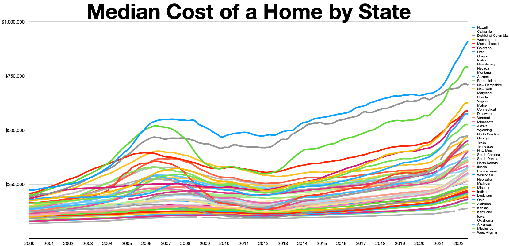
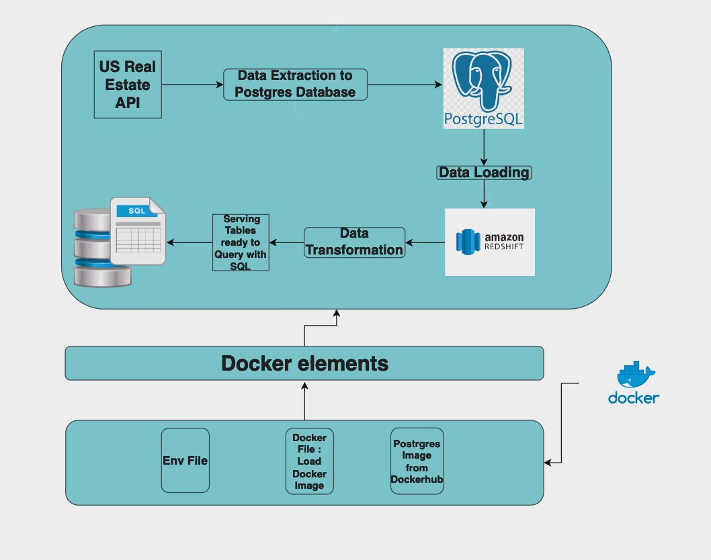
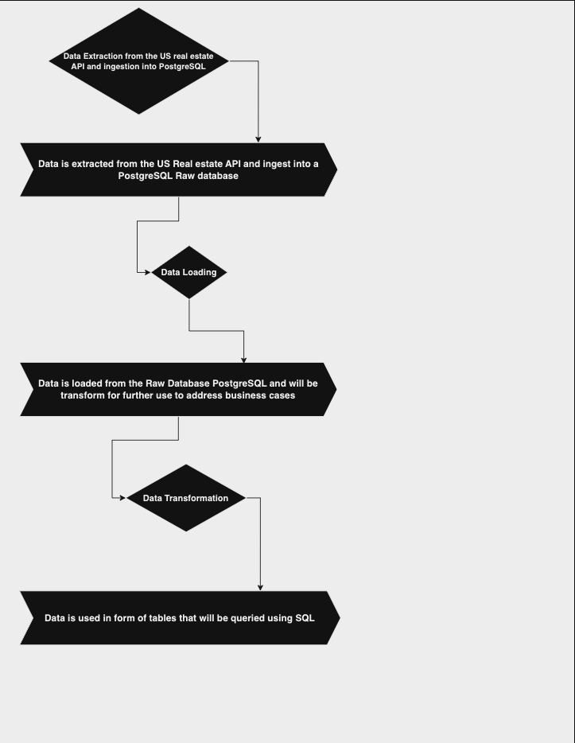

# dec-project-01

# **Table of Content**

* Introduction
* Median Cost of a Home by states
* Project Objective
* Data Source
* Analytical Questions
* Tools
* Architecture
* Workflow
* Pipeline Deployment
* Challenges

# **Deliverables**

* ELT pipeline that will extract data from the us real estate API and store it into a postgres Database. The extracted data will then be loaded into an analytical datawarehouse; Redshift where it will be transformed for further business cases usage.

# **Introduction**

Home prices have been fluctuating in several states over the past years and will continue to fizzle over the coming years with the cost of living driven by the inflation.  One the one hand,  with blisteringly high mortgage rates and scorching home prices becoming too hot to handle for the average home buyer, one the other hand, this situation is rather seen by investors as a mean to fatten up their bank accounts. Several factors are to take into consideration when someone commits to buy a house and these factors depend from one state to another. So knowing certain key information will facilitate the home buying process for home buyers and for investors this will allow them earn more revenue.

# Median Cost of a Home by State

Source : [here](https://upload.wikimedia.org/wikipedia/commons/thumb/9/9e/Cost_of_housing_by_State.webp/1660px-Cost_of_housing_by_State.webp.png)

# Project Objective

Our project objective is to provide both consumers and investors with key information and useful historical clean data of the US real estate market that will help facilitate one the one hand their home buying process, and on the other hand their investment decisions.

# Data Source

We are going to source data from the US real estate public API.

| Source name        | Source type | Source documentation                                                                                    |
| ------------------ | ----------- | ------------------------------------------------------------------------------------------------------- |
| US Real Estate API | API         | [https://rapidapi.com/datascraper/api/us-real-estate](https://rapidapi.com/datascraper/api/us-real-estate) |

# Analytical Questions

We are going to provide clear answers to the below quesitons that will help home buyers and investors in their decision making processes.

1. Longest days on the market by home size.
2. Average home price of top 10 most expensive homes sold.
3. 10 cheapest/most expensive homes/across all zip codes.
4. How long it took to sell the biggest homes per zip code.
5. When the most expensive homes were sold and where.
6. Location of most expensive homes sold.

# Tools

We are going to use the following tools to complete our project

| Tool              | Usage                                         |
| ----------------- | --------------------------------------------- |
| Python            | Coding language of the "ELT" pipeline         |
| Postgres Database | To host our raw data collected from  the API |
| Redshift          | to host analytical data                       |
| Docker            | to build, test and deploy the pipeline        |
|                   |                                               |
|                   |                                               |
|                   |                                               |

# Architecture

# Workflow

Raw Data will be collected from the Us Real estate API and stored into the raw database PostgreSQL. The raw data will then be loaded into the analytical database Redshift where it will be transformed and processed through tables using SQL.

# Pipeline Deployment

The Pipeline will built, tested and deployed using Docker. Docker will be ran on AWS

# Challenges

* Limitation in terms of the number of APIs calls
* Setting up the local development Environment
*
