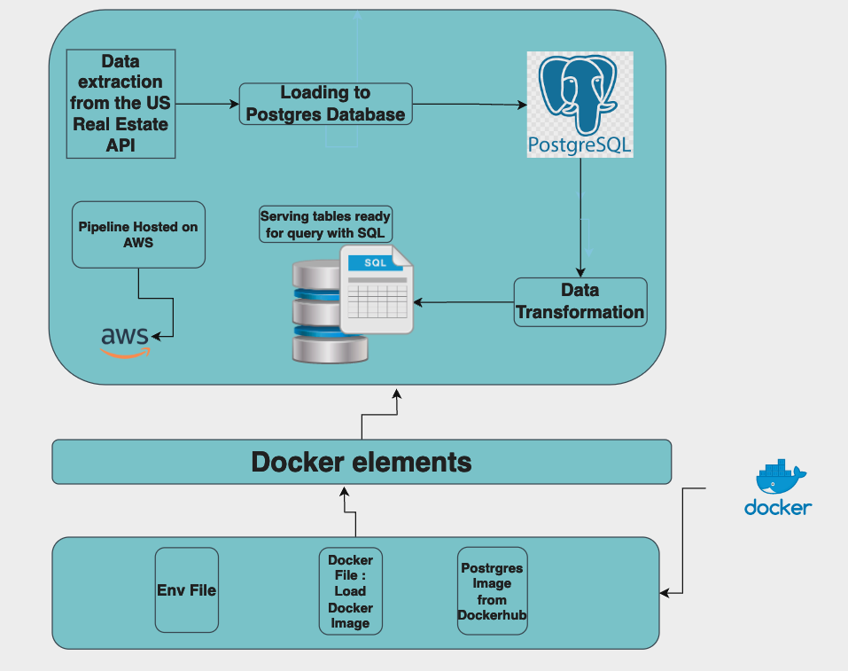

# dec-project-01

# **Table of Contents**

* Introduction
* Data Sources
* Analytical Questions
* Tools
* Architecture
* Challenges

# Introduction

Our goal in this project is to identify trends and answer questions regarding real estate in the United States and provide useful information to both home buyers and sellers which will help them in the decision-making process.

# Data Source

We are going to source data from the US real estate public API.

| Source name        | Source type | Source documentation                                                                                    |
| ------------------ | ----------- | ------------------------------------------------------------------------------------------------------- |
| US Real Estate API | API         | [https://rapidapi.com/datascraper/api/us-real-estate](https://rapidapi.com/datascraper/api/us-real-estate) |

# Analytical Questions

* How long did it take to sell the biggest homes per zip code?
* Longest days on the market by home size?
* Which cities, states, and regions are seeing below/above national average home prices
* What is the average home price in a state and how do home prices compare in the zip code that a prospective buyer is searching for homes in?
* How many sold homes are in each zip code?
* When the most expensive homes were sold and where?

# Tools

We are going to use the below tool for this project

| Tool              | Usage                                        |
| ----------------- | -------------------------------------------- |
| Python            | Coding language of the "ELT" pipeline        |
| Postgres Database | To host our raw data collected from  the API |
| Docker            | To build, test and deploy the pipeline       |
| AWS               | The pipeline will be hosted on AWS           |

# Architecture

