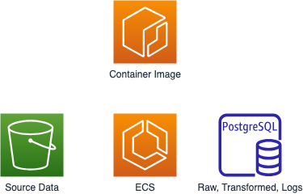

# Project plan 

## Objective 
The objective of the product is to provide property pricing trends in different areas of the United States.

## Consumers 
There two categories of consumers: home sellers and home buyers. 

## Questions 

1. What are pricing trends over X number of years?
2. Which cities, states, regions are seeing the most price growth?
3. Which cities, states, regions saw the most price growth during remote work boom in Covid?
4. What do the pricing trends look like in the same areas with remote work trends reversing?
5. Aside from Covid years, any other years of strong price growth/contraction?

## Source datasets 
What datasets are you sourcing from? How frequently are the source datasets updating?

Example: 

| Source name | Source type | Source documentation |
| - | - | - |
| Redfin Data Center | TSV | https://www.redfin.com/news/data-center/ | 

## Solution architecture
Hypothetical data scraper will take newest values from next month's TSV file

1. (Extract & Load) Ingest the dataset to Postgres with Python to raw table
2. (Transform) Raw input table perform transformations to create tables containing the query data that is useful for consumers.
3. Transformation patterns include data organized by year, by city, by state, by region

We recommend using a diagramming tool like [draw.io](https://draw.io/) to create your architecture diagram. 

Here is the solution architecture diagram: 

## Breakdown of tasks 
1. Python to ingest data to Postgres
2. SQL queries for the transformations
3. Python to run to run SQL queries
4. Python to run pipeline
5. Python to log pipeline
6. Docker image of the Python code
7. Run container in ECS

Trello board created and will add members pending receiving everyone's e-mail addresses: https://trello.com/b/UaWnmHYO/dec-project-1